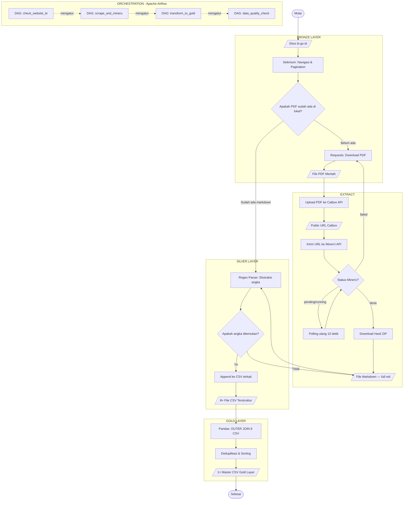

# Pipeline Ekstraksi Data Kesenjangan Ekonomi Regional Indonesia
## Tugas Besar : Analisis Big Data

Proyek ini adalah sebuah **Data Engineering Pipeline** end-to-end yang secara otomatis mengumpulkan (*scraping*), mengekstrak (*parsing*), mentransformasi, dan menyimpan data indikator kesenjangan ekonomi dari **Laporan Perekonomian Provinsi (LPP) / Kajian Ekonomi Regional (KER)** yang dipublikasikan oleh Bank Indonesia.

**Cakupan Data:** 34 Provinsi × Rentang Tahun 2015–2024.

---

## Daftar Isi

- [Output Akhir](#-output-akhir-hasil-ekstraksi)
- [Technology Stack](#-technology-stack--prasyarat)
- [Arsitektur Pipeline](#️-arsitektur-pipeline)
- [Arsitektur Data Engineering (Medallion)](#-arsitektur-data-engineering-medallion--orkestrasi)
- [Mengapa Teknologi Ini?](#-mengapa-memilih-teknologi-ini-rationale)
- [Cara Menjalankan](#-cara-menjalankan)
- [Troubleshooting](#-troubleshooting-pemecahan-masalah)
- [Struktur Folder](#-struktur-folder-lengkap)
- [Referensi Akademis](#-referensi-akademis--sumber-belajar)

---

## Output Akhir (Hasil Ekstraksi)

Setiap PDF yang berhasil diunduh akan dibaca menggunakan *AI Vision-Language Model* (MinerU) dan secara otomatis diekstrak menjadi **8 Master File CSV** yang berada di dalam folder `data/hasil_ekstraksi/`:

| No | File CSV | Indikator | Satuan |
|----|----------|-----------|--------|
| 1 | `gini_ratio.csv` | Rasio Gini (Total, Kota, Desa) | Indeks (0–1) |
| 2 | `kemiskinan.csv` | % Penduduk Miskin, Jumlah, Garis Kemiskinan, P1, P2 | %, Ribu Jiwa, Rp |
| 3 | `ipm.csv` | Indeks Pembangunan Manusia | Indeks (0–100) |
| 4 | `distribusi_pendapatan.csv` | Pangsa Pengeluaran 40% Terbawah | % |
| 5 | `ketenagakerjaan.csv` | TPT dan TPAK | % |
| 6 | `inflasi.csv` | Tingkat Inflasi Tahunan | % |
| 7 | `pdrb.csv` | Pertumbuhan Ekonomi (PDRB) | % |
| 8 | `ntp.csv` | Nilai Tukar Petani | Indeks |

> **Catatan:** Masing-masing file CSV dilengkapi kolom `provinsi`, `tahun`, `periode`, dan `source_file` untuk keperluan pelacakan (*data lineage*) ke dokumen aslinya.

---

## 🛠 Technology Stack & Prasyarat

| Kategori | Teknologi | Versi | Fungsi |
|----------|-----------|-------|--------|
| Bahasa | Python | 3.12+ | Bahasa utama seluruh pipeline |
| Web Scraping | Selenium + ChromeDriver | 4.x | Otomasi browser untuk navigasi situs BI |
| HTTP Client | Requests | 2.x | Mengunduh PDF dan berkomunikasi dengan API |
| AI PDF Parser | MinerU API (VLM) | v4 | Mengubah PDF bergambar menjadi teks Markdown |
| File Hosting | Catbox.moe API | — | Menyediakan *public URL* sementara agar MinerU dapat membaca PDF |
| Data Processing | Pandas | 2.x | Transformasi & penggabungan CSV (Gold Layer) |
| Pattern Matching | Regex (re) | built-in | Mengekstrak angka spesifik dari teks Markdown |
| Orkestrasi | Apache Airflow | 2.9 | Penjadwalan & monitoring DAG pipeline |
| Kontainerisasi | Docker + Docker Compose | 29.x | Menjalankan Airflow dan MinIO dalam lingkungan terisolasi |
| Custom Image | Dockerfile (Airflow + Chrome) | — | Merakit Google Chrome ke dalam kontainer Airflow agar Selenium dapat berjalan sepenuhnya di dalam Docker |
| Data Lake | MinIO Object Storage | latest | Penyimpanan *bucket* Bronze/Silver/Gold layaknya AWS S3 |
| Progress Bar | tqdm | 4.x | Menampilkan progres visual di terminal |

**Instalasi Dependensi:**
```bash
pip install selenium webdriver-manager requests tqdm pandas
```

---

## ⚙️ Arsitektur Pipeline

Berikut adalah bagan alir (*flowchart*) keseluruhan pipeline : 



### Penjelasan Alur Langkah demi Langkah

1. **Web Scraping (Selenium):** Membuka situs `bi.go.id`, mensimulasikan klik halaman (*pagination*) layaknya manusia (dengan *random delay* 8–15 detik), dan mengunduh setiap PDF laporan ke folder `data/<Provinsi>/`.

2. **Upload ke Catbox (Temporary File Host):** Karena file laporan BI sangat besar (sering > 30MB) dan API AI (MinerU) membutuhkan URL publik untuk membaca PDF, file PDF diunggah sementara ke `catbox.moe` via API-nya. Catbox dipilih karena:
   - Gratis, tanpa registrasi, tanpa API Key.
   - Memberikan *direct link* tanpa halaman *Captcha* atau pelindung bot.
   - Mendukung file hingga 200MB.

3. **MinerU API (VLM Extract):** URL publik Catbox dikirimkan ke MinerU API (menggunakan *Vision-Language Model*). MinerU membaca seluruh halaman PDF — termasuk tabel bergambar, grafik, dan teks — lalu mengubahnya menjadi format `Markdown` (.md) yang terstruktur. Hasil disimpan sebagai *backup* di folder `data/<Provinsi>/`.

4. **Pencocokan Pola (Regex Parser):** Script membaca teks Markdown tersebut menggunakan puluhan pola *Regular Expression* (Regex) yang dirancang khusus untuk mengenali format angka Bahasa Indonesia (contoh: `0,345` untuk Gini, `15,23%` untuk kemiskinan). Angka yang berhasil diekstrak langsung di-*append* ke 8 master CSV.

---

## Arsitektur Data Engineering (Medallion & Orkestrasi)

Proyek ini mengadopsi dua konsep fundamental *Data Engineering* modern:

### 1. Medallion Architecture (Bronze → Silver → Gold)

Arsitektur Medallion adalah pola desain yang dipopulerkan oleh **Databricks** (perusahaan pendiri Apache Spark) untuk mengorganisasi data dalam *Data Lakehouse*. Ide utamanya: **data dibersihkan secara bertahap melalui tiga lapisan (layer)** agar setiap lapisan memiliki tingkat kualitas yang semakin tinggi.

| Layer | Isi | Lokasi di Proyek Ini |
|-------|-----|----------------------|
| 🥉 **Bronze** | Data mentah apa adanya | `data/<Provinsi>/*.pdf` & `*.md` |
| 🥈 **Silver** | Data terstruktur, dibersihkan | `data/hasil_ekstraksi/*.csv` (8 file) |
| 🥇 **Gold** | Data gabungan, diimputasi (ffill/bfill), siap analisis | `data/gold_kesenjangan_regional_master.csv` |

**Mengapa bertahap?** Karena jika proses pembersihan gagal di tengah jalan (misalnya AI MinerU salah membaca angka), saya bisa menelusuri kembali (*trace*) ke lapisan sebelumnya tanpa harus memulai dari nol. Ini disebut **data lineage** — salah satu pilar utama *Data Governance*.

### 2. Evolusi Kematangan: Dari Lokal ke Enterprise (Airflow + MinIO)

Proyek ini mendemonstrasikan pemahaman saya atas **siklus utuh Data Engineering**. Saya membangun *pipeline*-nya terlebih dahulu secara lokal menggunakan skrip Python murni (`ektraksi.py`). Namun, sebagai bukti pemahaman arsitektur skala enterprise, saya mengangkat *pipeline* yang sama ke dalam ekosistem **Apache Airflow** (sebagai Orkestrator) dan **MinIO** (sebagai Data Lake).

Tujuannya bukanlah membandingkan kecepatan, melainkan mendemonstrasikan **tingkat kematangan arsitektur** (*maturity level*):
- **Lokal:** Eksekusi manual, data berserakan di folder lokal, rentan berhenti jika ada *error*.
- **Enterprise:** Eksekusi terjadwal otomatis, data tertata rapi di *bucket* Object Storage (MinIO), dan tangguh terhadap kegagalan berkat fitur *auto-retry* dari Airflow.

Apache Airflow adalah orkestrator paling populer di industri (digunakan oleh Airbnb, Google, Twitter). Proyek ini memiliki file `dags/bi_pipeline_dag.py` yang mendefinisikan alur kerja sebagai **DAG (Directed Acyclic Graph)**:

```
check_website_bi ──▶ scrape_and_mineru_to_bronze_silver ──▶ transform_to_gold_layer ──▶ upload_gold_to_minio ──▶ data_quality_check
```

| Task | Fungsi | Retry |
|------|--------|-------|
| `check_website_bi` | Mengecek apakah website BI dapat diakses sebelum memulai | — |
| `scrape_and_mineru_to_bronze_silver` | Menjalankan **Selenium** (Google Chrome Headless yang ter-*install* di dalam Docker) untuk scraping BI, mengekstrak PDF ke Markdown, dan mengisi Silver Layer | 3× (jeda 5 menit) |
| `transform_to_gold_layer` | Menggabungkan 8 CSV menjadi 1 Master Gold CSV menggunakan Pandas | 3× |
| `upload_gold_to_minio` | Mengunggah seluruh data ke MinIO (Bronze, Silver, Gold) | 3× |
| `data_quality_check` | Memvalidasi jumlah baris, kolom, dan nilai NULL pada Gold Layer | — |

**Keunggulan Airflow vs eksekusi skrip lokal:**
- **Penjadwalan otomatis (Cron):** Pipeline saya atur untuk berjalan otomatis setiap bulan (`@monthly`).
- **Fault-tolerance:** Jika MinerU API *down*, Airflow akan otomatis mengulangi tugas (*retry*) tanpa campur tangan saya.
- **Monitoring visual:** Airflow menyediakan *Web UI* di `localhost:8080` untuk melihat status setiap tugas (hijau = sukses, merah = gagal).
- **Dependency management:** Airflow menjamin bahwa `transform_to_gold_layer` tidak akan pernah berjalan sebelum `scrape_and_mineru_to_silver` benar-benar selesai.

> **Catatan Performa (Docker + WSL):**
> Mengeksekusi *pipeline* ini di dalam Docker melalui WSL 2 di Windows memang menimbulkan pinalti baca-tulis file (*I/O penalty* akibat *Protocol 9P*). Namun, *bottleneck* utama *pipeline* ini adalah **Network Latency** (menunggu unduhan PDF dari BI dan antrean API MinerU), bukan kecepatan disk. Oleh karena itu, pinalti I/O sangat bisa diabaikan (*negligible*). Fokus saya menggunakan Airflow dan MinIO adalah pada **skalabilitas, tata kelola data, dan ketahanan (fault-tolerance)**, bukan adu cepat komputasi per milidetik.

---

## Mengapa Saya Memilih Teknologi Ini?

Bagian ini menjelaskan rasionalisasi arsitektural yang saya ambil selama pengerjaan Tugas Besar ini.

### Mengapa MinerU (AI VLM), bukan PyPDF2/Tabula/Camelot?
Laporan BI menggunakan format PDF yang **sangat tidak ramah mesin**: tabel disimpan sebagai gambar , bukan teks. Library tradisional seperti `PyPDF2` hanya bisa membaca teks biasa, sedangkan `Tabula` dan `Camelot` hanya bekerja pada tabel berbasis teks. **MinerU menggunakan model bahasa visual (VLM)** yang mampu "melihat" gambar tabel layaknya manusia membaca, sehingga menjadi solusi yang mampu menangani PDF BI ini.

### Mengapa Catbox.moe, bukan Cloudflare Tunnel / Google Drive?
- **Cloudflare Tunnel** (solusi awal): Sering diblokir oleh *bot protection* Cloudflare sendiri, menyebabkan MinerU gagal mengunduh PDF.
- **Google Drive API**: Membutuhkan konfigurasi OAuth 2.0 dan *Service Account JSON* yang rumit.
- **Catbox.moe**: Gratis, tanpa autentikasi, memberikan *direct link* tanpa *Captcha*. Sempurna untuk kasus penggunaan *temporary file sharing*.
### Mengapa TIDAK menggunakan Apache Spark & Hadoop?
Hadoop/Spark dirancang untuk data berukuran **Terabyte–Petabyte** yang tidak muat di RAM satu komputer. Data hasil ekstraksi kita (Gold Layer) hanya berukuran beberapa **Megabyte**. Menggunakan Spark untuk memproses data sekecil ini justru akan **lebih lambat** daripada Pandas, karena ada *overhead* menyalakan JVM (*Java Virtual Machine*) dan mendistribusikan tugas ke *node-node worker*.

### Mengapa Regex, bukan NLP/Machine Learning?
Pola angka dalam laporan BI cukup konsisten (contoh: "Gini Ratio sebesar 0,345"). Regex mampu menangkap pola ini dengan akurasi tinggi dan kecepatan eksekusi < 1 milidetik per dokumen. Menggunakan model NLP (seperti spaCy atau GPT) untuk tugas ini akan menambah dependensi besar, waktu inferensi yang jauh lebih lambat, dan kompleksitas yang tidak sebanding dengan hasilnya.

---

## Cara Menjalankan Pipeline

Terdapat tiga cara menjalankan *pipeline* ini. Pilih sesuai kebutuhan:

---

### Cara A: Eksekusi Lokal (Manual via Terminal)
Cocok untuk pengembangan dan pengujian langsung di terminal.

**Langkah 1 — Siapkan lingkungan Python:**
```bash
# Buat virtual environment (hanya sekali)
python -m venv venv

# Aktifkan virtual environment
source venv/Scripts/activate   # Di WSL/Linux
# .\venv\Scripts\activate       # Di Windows (PowerShell)

# Install semua dependensi dari requirements.txt
pip install -r requirements.txt
```

**Langkah 2 — Nyalakan MinIO (Data Lake):**
```bash
docker compose up -d minio minio-init
```
Buka **`http://localhost:9001`** (user: `minioadmin`, password: `minioadmin`).
*Bucket `bronze`, `silver`, dan `gold` akan terbentuk secara otomatis.*

**Langkah 3 — Jalankan Ekstraksi:**
```bash
# Di Windows (PowerShell/CMD):
python src/ektraksi.py

# Di WSL (Linux):
venv/Scripts/python.exe src/ektraksi.py
```
> Sambil terminal berjalan, *refresh* halaman MinIO di browser. File Markdown akan muncul di `bronze` dan baris data di 8 CSV `silver` terus bertambah secara *real-time*!

**Langkah 4 — Transformasi ke Gold Layer:**
```bash
python src/transform_gold_layer.py
python src/upload_to_minio.py
```

---

### Cara B: Eksekusi via Apache Airflow (Terorkestasi + Terjadwal)
Pendekatan *enterprise* penuh. Airflow menjalankan seluruh *pipeline* otomatis menggunakan Selenium sesungguhnya di dalam kontainer Docker kustom (sudah ada Google Chrome di dalamnya).

**Langkah 1 — Build dan nyalakan seluruh sistem:**
```bash
# Pertama kali / setelah ada perubahan Dockerfile:
docker compose up -d --build

# Selanjutnya (tanpa perlu build ulang):
docker compose up -d
```

**Langkah 2 — Buka Airflow UI:**
Tunggu ~1-2 menit, lalu buka **`http://localhost:8080`**
- Username: `airflow` | Password: `airflow`

**Langkah 3 — Aktifkan dan Trigger DAG:**
1. Cari DAG bernama **`bi_laporan_ekstraksi_medallion`**.
2. Klik **toggle** di sebelah kiri namanya agar menjadi **biru (aktif)**.
3. Klik tombol **▶ (Trigger DAG)** untuk menjalankan sekarang.
4. Masuk ke tab **Graph** untuk memantau diagram alur kerja secara visual:
   - 🟡 Kuning = Sedang berjalan | 🟢 Hijau = Sukses | 🔴 Merah = Gagal

---

### Cara C: Setup Teman sebagai Worker (Komputasi Terdistribusi Cloud)
Berkat arsitektur *Cloud* (Supabase untuk Database & Upstash untuk Redis), laptop teman Anda bisa bergabung sebagai *Worker* dari **mana saja di seluruh dunia** tanpa perlu VPN (seperti ZeroTier/Tailscale).

**Prasyarat:** Teman Anda hanya butuh Docker Desktop dan koneksi internet publik.

**Langkah 1: Di Laptop Worker (Teman)**
```bash
# 1. Clone proyek dari GitHub
git clone https://github.com/Razin907/tubes-abd-klp4.git
cd tubes-abd-klp4

# 2. Minta file .env dari Master
# Teman Anda harus menggunakan file .env yang SAMA PERSIS dengan milik Master
# (lengkap dengan URL Supabase dan Upstash).
# NAMUN, ubah baris WORKER_HOSTNAME menjadi nama laptop teman Anda agar mudah dikenali.
# Contoh isi .env:
# AIRFLOW__DATABASE__SQL_ALCHEMY_CONN=postgresql://...supabase.co...
# AIRFLOW__CELERY__RESULT_BACKEND=db+postgresql://...supabase.co...
# AIRFLOW__CELERY__BROKER_URL=rediss://...upstash.io...
# WORKER_HOSTNAME=worker-hanna

# 3. Nyalakan Worker menggunakan konfigurasi khusus
docker compose -f docker-compose.worker.yaml up -d --build
```
*Worker TIDAK menjalankan database atau webserver. Ia murni hanya menjadi "otot" komputasi yang menerima perintah dari Supabase/Upstash.*

**Langkah 2: Verifikasi & Scaling**
Buka **`http://localhost:5555`** (Flower Dashboard) di laptop Master untuk memastikan laptop teman Anda (`celery@worker-hanna`) muncul di daftar Worker aktif secara *real-time*.
Jika ada teman ke-3 atau ke-4 yang ingin bergabung, ulangi Langkah 1 untuk mereka.

> **SANGAT PENTING: UPDATE KODE DAG!**
> Secara *default*, DAG dibatasi hanya menjalankan 2 task bersamaan (`max_active_tis_per_dag=2` di file `dags/bi_pipeline_dag.py`). 
> Jika total laptop yang bekerja bertambah (misal 1 Master + 3 Worker), Anda **WAJIB mengubah** baris kode tersebut menjadi `max_active_tis_per_dag=8` atau lebih di laptop Master, lalu dorong ke GitHub (`git push`). Jika tidak diubah, laptop tambahan hanya akan menganggur menunggu giliran!

---

### 7. Tahap Visualisasi Data (Streamlit Dashboard)
Setelah seluruh data masuk ke Data Lakehouse (MinIO), kita memvisualisasikannya secara *real-time* menggunakan **Streamlit**. Dashboard ini tidak membaca file lokal dari komputer, melainkan terkoneksi **langsung ke server MinIO** (`bucket: gold`), mendemonstrasikan ekosistem Data Lakehouse yang sesungguhnya!

**Cara Menjalankan Dashboard:**
```bash
streamlit run dashboard.py
```

**Fitur Utama Dashboard:**
1. **Direct MinIO Connection:** Terkoneksi ke Data Lake via `minio-python`. Memiliki sistem *fallback* cerdas yang otomatis membaca data lokal jika server MinIO sedang mati (*fail-safe*).
2. **Data Imputasi Sempurna:** Berkat metode *Forward-Fill* dan *Backward-Fill* di Gold Layer, *Line Chart* tren tahunan menjadi mulus (tidak putus-putus/bolong).
3. **Analisis Komprehensif:** Dilengkapi visualisasi metrik agregat, komparasi antarprovinsi (*Bar Chart*), dan korelasi antarindikator (*Scatter Plot* seperti IPM vs Kemiskinan).

---

   Jika ada PDF yang format penulisannya sangat melenceng (sehingga gagal di-*parsing* oleh AI/Regex), file asli PDF dan Markdown-nya (`.md`) tetap tersimpan di folder `data/<Nama Provinsi>/`. Anda bisa mengecek manual nilai pada file tersebut.

2. **Gagal Download dari BI (Error Selenium):**
   Situs Bank Indonesia mungkin me-*reset* sesi jika diakses terlalu sering. Script sudah dilengkapi *random delay* (8–15 detik) untuk bertindak selayaknya manusia (*anti-bot protection*). Jika masih gagal, script memiliki `MAX_RETRY = 3` dan akan mencoba lagi secara otomatis.

3. **MinerU API Timeout:**
   Jika koneksi internet lambat atau antrean MinerU sedang padat, proses *polling* bisa memakan waktu hingga 30 menit per dokumen. Script akan otomatis menunggu dan mencatat status di log. Jangan matikan terminal selama proses berjalan.

---

## 📁 Struktur Folder & Anatomi Skrip

Proyek ini saya rancang secara *modular* agar fungsi ekstraksi, transformasi, dan pemuatan data (*load*) terpisah dengan rapi. Berikut adalah penjelasan anatomi kode yang saya bangun:

### 1. `src/ektraksi.py` (Sang Mandor / *The Driver*)
Ini adalah program utama (*entry point*) yang menggerakkan seluruh *pipeline* secara lokal.
- **Tugas Utama:** Mengendalikan robot peramban (Selenium) untuk membuka situs web Bank Indonesia, menavigasi halaman (*pagination*), dan mengunduh ratusan file PDF secara otomatis.
- **Integrasi:** Setelah berhasil mengunduh satu PDF, skrip ini akan langsung memanggil `upload_to_minio.py` untuk melempar PDF tersebut ke *bucket* **Bronze** di MinIO secara *real-time*, lalu mendelegasikan tugas pembacaan PDF ke `mineru_parser.py`.

### 2. `src/mineru_parser.py` (Sang Otak AI & Pengekstrak)
Ini adalah jantung analitis dari proyek saya.
- **Tugas Utama:** Mengunggah PDF ke Catbox untuk mendapatkan tautan publik, mengirimkannya ke AI MinerU (Vision-Language Model), lalu membedah hasil *Markdown* (.md) menggunakan *Regular Expression* (Regex) tingkat lanjut.
- **Keluaran:** Skrip ini memburu angka kemiskinan, Gini Ratio, IPM, dll., lalu menyisipkannya baris demi baris ke 8 Master CSV terpisah (menciptakan **Silver Layer**). File Markdown dan CSV yang terbarui akan langsung di-*stream* ke MinIO.

### 3. `src/transform_gold_layer.py` (Sang Peracik / *Data Modeler*)
Skrip ini bertugas memoles data di tahap akhir.
- **Tugas Utama:** Menggunakan library `Pandas` untuk membuka 8 kepingan file CSV dari *Silver Layer*, lalu menyatukannya dengan operasi SQL `OUTER JOIN` berdasarkan kunci "Provinsi" dan "Tahun".
- **Imputasi Data (Filling the Gaps):** Skrip ini secara otomatis mengisi nilai kosong (*NaN/NULL*) menggunakan teknik **Forward-Fill (ffill)** dan **Backward-Fill (bfill)** yang dikelompokkan secara spesifik per provinsi. Ini krusial untuk memastikan grafik *time-series* tidak putus.
- **Keluaran:** 1 buah Master Tabel (**Gold Layer**) yang bersih, padat, bebas duplikasi, dan siap disajikan ke alat BI (Streamlit/Metabase).

### 4. `src/upload_to_minio.py` (Sang Kurir / *Storage Connector*)
Ini adalah jembatan penghubung antara skrip lokal Python saya dengan *Data Lake* (MinIO) di dalam kontainer Docker.
- **Tugas Utama:** Menyediakan fungsi-fungsi bantuan agar skrip ekstraksi dapat langsung "meneteskan" data (*streaming*) ke *bucket* `bronze`, `silver`, dan `gold` kapan pun diperlukan, tanpa harus menunggu proses keseluruhan selesai.

### 5. `dags/bi_pipeline_dag.py` (Sang Dirigen / *The Orchestrator*)
Bukan untuk dieksekusi secara manual, ini adalah buku instruksi khusus untuk **Apache Airflow**.
- **Tugas Utama:** Mengeksekusi seluruh *pipeline* secara otomatis dan terorkestasi: pengecekan situs BI, menjalankan Selenium (Google Chrome Headless di dalam Docker), ekstraksi ke Silver, penggabungan ke Gold, upload ke MinIO, hingga validasi kualitas data.
- **Jadwal:** Berjalan otomatis setiap bulan (`@monthly`) dengan *auto-retry* 3 kali jika terjadi kegagalan jaringan.

### 6. `Dockerfile` (Sang Arsitek Kontainer)
File "resep" untuk merakit kontainer Docker Airflow yang kustom.
- **Tugas Utama:** Mengambil *image* resmi Airflow 2.9.1, lalu meng-*install* Google Chrome dan semua *library* Python ke dalamnya agar Airflow dapat menjalankan skrip Selenium sepenuhnya di dalam ekosistem Docker.

```
tubes/
├── src/
│   ├── ektraksi.py              # Mandor (Web Scraper + MinIO Trigger)
│   ├── mineru_parser.py         # Otak AI (Catbox, MinerU, Regex)
│   ├── transform_gold_layer.py  # Pandas (JOIN 8 CSV → 1 Gold CSV)
│   └── upload_to_minio.py       # Kurir (MinIO S3 API connector)
├── dags/
│   └── bi_pipeline_dag.py       # Dirigen (Airflow DAG — eksekusi Selenium nyata)
├── data/
│   ├── <Nama Provinsi>/         # (Bronze) Backup lokal Markdown per laporan
│   ├── hasil_ekstraksi/         # (Silver) 8 file CSV terstruktur
│   ├── gold_*.csv               # (Gold) Master tabel gabungan
│   ├── log_ekstraksi.csv        # Log ringkas per-file
│   └── log_scraper.log          # Log detail teknis (debugging)
├── Dockerfile                   # Resep image kustom (Airflow + Google Chrome)
├── docker-compose.yaml          # Infrastruktur Airflow + MinIO (Docker)
├── .env                         # Variabel lingkungan (AIRFLOW_UID)
├── .gitignore                   # Daftar file yang tidak di-track Git
└── README.md                    # Dokumentasi Utama
```

---

## Referensi & Sumber

| Topik | Sumber | URL |
|-------|--------|-----|
| Medallion Architecture | Databricks (Official) | https://www.databricks.com/glossary/medallion-architecture |
| Apache Airflow | Apache Software Foundation | https://airflow.apache.org/docs/ |
| MinIO Object Storage | MinIO Inc. | https://min.io/docs/minio/linux/index.html |
| MinerU (PDF Parser AI) | OpenDataLab | https://mineru.net |
| Selenium WebDriver | SeleniumHQ | https://www.selenium.dev/documentation/ |
| Regex (Regular Expression) | Python Official Docs | https://docs.python.org/3/library/re.html |
| Pandas DataFrame | pandas-dev | https://pandas.pydata.org/docs/ |
| Docker Compose | Docker Inc. | https://docs.docker.com/compose/ |
| Data Lineage & Governance | DAMA International | https://www.dama.org/cpages/body-of-knowledge |

---
